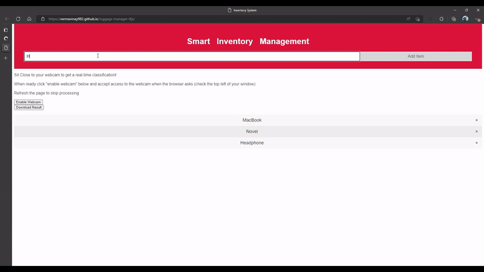
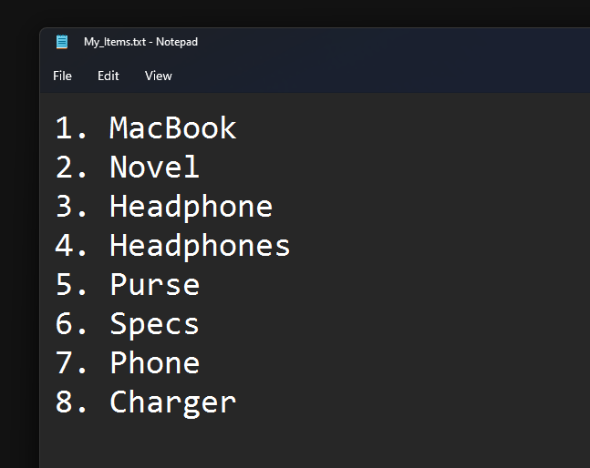

# Luggage List Creation Became Easy :P

Create Long Item List for Luggage, by just showing it to web camera during packing, Tesorflow JS

Goal of Project: Reduce error in Luggage list, Computer will do it efficiently and faster.

Live At: https://vermavinay982.github.io/luggage-manager-tfjs/

## Final List that you can download

It runs on browser with minimal resources, no more weights to download, just open the website and processing will start.

